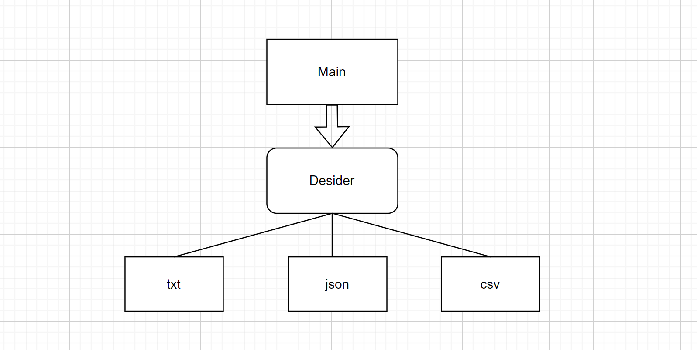

# app-my
My test application for python based serialize/deserialize functions

Status of last CI Workflow pylint and pytests results: 
 
 

Copyleft by Andrey Maksyuta  app-my 2022.

## Application architecture 

## 1. System requirements ==> Python3.10.4, git2.45

Git:

Download git from https://gitforwindows.org/.

Python :

Download and install from https://www.python.org/downloads/release/python-3104/ as Administrator.

Python modules install:

Run in CMD : `pip install argparse`.

Run in CMD : `pip install pathlib`.

## 2. Run application from CMD:

Run in CMD : `./app.py -i test.txt -o test444.json`.

## 3. Test txt input file content:

Put this content to the file test.txt in Root directory:

`Bob,Manchectes Street 56,3456`  
`Anna,Amelie Avenu 33,5667`  
`Sam,Sant Jones Street 39,2345`  
`Diego,Mary Street 66,7689`  

